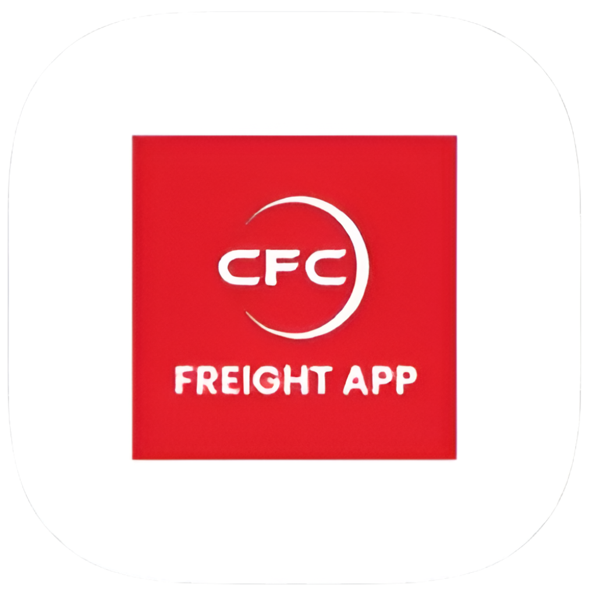

# 🚛 Freight Management App

<div align="center">



**A comprehensive freight and logistics management mobile application built with React Native and Expo**

[](https://github.com/otikanelson/CFC-freight)
[](https://reactnative.dev/)
[](https://expo.dev/)
[](https://www.typescriptlang.org/)

[🚀 Features](#-features) • [📱 Screenshots](#-screenshots) • [⚡ Getting Started](#-getting-started) • [🏗️ Tech Stack](#️-tech-stack) • [🔧 Installation](#-installation)

</div>

---

## 📱 Screenshots

<div align="center">

### 🎨 **Splash & Authentication**


*Beautiful glassmorphism design with smooth animations*

### 🏠 **Main Dashboard & Navigation**


*Modern glass-effect navigation with intuitive user experience*

### 📋 **Core Features**


*Comprehensive freight management tools at your fingertips*

### 👤 **Profile & Support**


*Complete user management and support system*

</div>

---

## 🚀 Features

### 🎯 **Core Functionality**
- **🔐 Secure Authentication** - JWT-based login/signup with guest mode
- **📦 Clearing Management** - Streamlined customs clearing processes
- **🚚 Logistics Coordination** - Real-time logistics and transportation management
- **📋 Customs Documentation** - Digital customs forms and compliance tracking
- **📞 Integrated Support** - Built-in customer support and communication

### 🎨 **Design Excellence**
- **✨ Glassmorphism UI** - Modern glass-effect design language
- **🌈 Gradient Themes** - Beautiful linear gradients and visual hierarchy
- **📱 Responsive Layout** - Optimized for all screen sizes
- **🔄 Smooth Animations** - Fluid transitions and micro-interactions

### 🔧 **Technical Features**
- **🔒 Secure Storage** - Encrypted local data storage with Expo SecureStore
- **🌐 REST API Integration** - Full-featured backend API connectivity
- **📱 Cross-Platform** - iOS, Android, and Web support
- **⚡ Performance Optimized** - Efficient state management and rendering

---

## 🏗️ Tech Stack

<div align="center">

| Frontend | Backend | Tools & Services |
|----------|---------|------------------|
|  |  |  |
|  |  |  |
|  |  |  |

</div>

### 📚 **Key Dependencies**
```json
{
  "react-native": "0.81.5",
  "expo": "~54.0.34",
  "expo-blur": "^56.0.3",
  "expo-linear-gradient": "~15.0.8",
  "expo-secure-store": "^57.0.0",
  "@react-native-async-storage/async-storage": "^3.1.1",
  "axios": "^1.18.1"
}
```

---

## ⚡ Getting Started

### 📋 **Prerequisites**
- Node.js (v16 or higher)
- npm or yarn
- Expo CLI (`npm install -g @expo/cli`)
- iOS Simulator or Android Emulator (optional)

### 🔧 Installation

1. **Clone the repository**
   ```bash
   git clone https://github.com/otikanelson/CFC-freight.git
   cd Freight
   ```

2. **Install dependencies**
   ```bash
   npm install
   ```

3. **Set up environment variables**
   ```bash
   cp .env.example .env
   # Edit .env with your configuration
   ```

4. **Start the development server**
   ```bash
   npm start
   ```

5. **Run on your preferred platform**
   ```bash
   # iOS
   npm run ios
   
   # Android
   npm run android
   
   # Web
   npm run web
   ```

### 🔙 **Backend Setup**
1. **Navigate to backend directory**
   ```bash
   cd freight-backend
   ```

2. **Install backend dependencies**
   ```bash
   npm install
   ```

3. **Configure environment**
   ```bash
   cp .env.example .env
   # Add your database and JWT configurations
   ```

4. **Start the backend server**
   ```bash
   npm run dev
   ```

---

## 🌐 Deployment

### 📱 **Mobile App**
The app is built with Expo and can be deployed to:
- **📱 App Store** - iOS deployment via EAS Build
- **🤖 Google Play Store** - Android deployment via EAS Build
- **🌐 Web** - Hosted on Vercel or Netlify

### 🔙 **Backend API**
The backend is deployed on **Vercel** with serverless functions:
- **🚀 Production**: [https://your-app.vercel.app](https://your-app.vercel.app)
- **📊 Health Check**: `/health`
- **🔐 API Endpoints**: `/api/auth/*`

---

## 📁 Project Structure

```
Freight/
├── 📱 App.tsx                 # Main app component
├── 📁 screens/                # Screen components
│   ├── AuthScreen.tsx
│   ├── HomeScreen.tsx
│   ├── ProfileScreen.tsx
│   └── SupportScreen.tsx
├── 🧩 components/             # Reusable components
│   ├── AppNavigator.tsx
│   ├── GlassCard.tsx
│   ├── LoginForm.tsx
│   └── SignUpForm.tsx
├── 🔧 services/               # API and storage services
│   ├── api.ts
│   ├── authService.ts
│   └── storageService.ts
├── 🎨 assets/                 # Images and icons
├── 🔙 freight-backend/        # Backend API
│   ├── src/
│   │   ├── routes/
│   │   ├── middleware/
│   │   └── config/
│   ├── api/                   # Vercel serverless functions
│   └── vercel.json            # Deployment configuration
└── 📄 README.md
```

---

## 🤝 Contributing

We welcome contributions! Please follow these steps:

1. **Fork the repository**
2. **Create a feature branch**: `git checkout -b feature/amazing-feature`
3. **Commit changes**: `git commit -m 'Add amazing feature'`
4. **Push to branch**: `git push origin feature/amazing-feature`
5. **Open a Pull Request**

---

## 📄 License

This project is licensed under the **ISC License** - see the [LICENSE](LICENSE) file for details.

---

## 👨‍💻 Developer

<div align="center">

**Otika Nelson**

[](https://github.com/otikanelson)
[](https://linkedin.com/in/otikanelson)

</div>

---

## 🙏 Acknowledgments

- **Expo Team** - For the amazing development platform
- **React Native Community** - For continuous support and resources
- **Design Inspiration** - Modern glassmorphism and mobile-first design trends

---

<div align="center">

**⭐ Star this repository if you find it helpful!**

Made with ❤️ by [Otika Nelson](https://github.com/otikanelson)

</div>